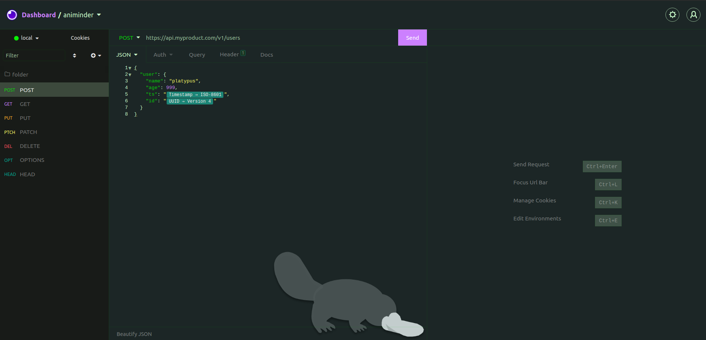

Custom dark theme for Insomnia

Now with a platypus on the scren!

To install it go to Application > Preferences > Plugins, type the package name "insomnia-plugin-platypus-dark-theme" and hit Install Plugin.
That's it! =)

There are 2 themes for now: 
- Default Platypus Theme
- No Platypus ='(

~ Choose wisely ~

Thank you everyone who downloaded this theme, I never thought that it would hit this many downloads~

Preview:
